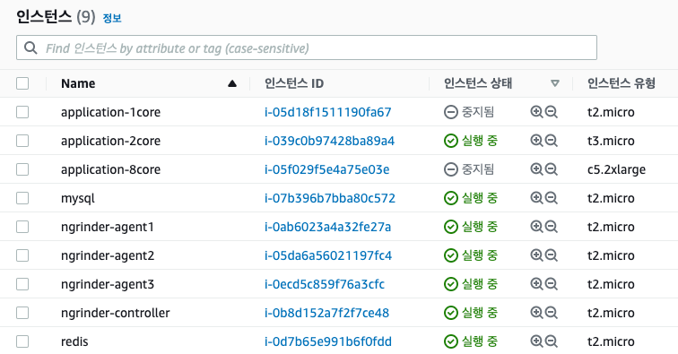

# (ngrinder를 이용한) core에 따른 tps, repository 서비스에 따른 tps 비교

## ngrinder 구성
| ngrinder   | core | memory |
| ---------- | ---- | ------ |
| controller | 1    | 1gb    |
| agent1     | 1    | 1gb    |
| agent2     | 1    | 1gb    |
| agent3     | 1    | 1gb    |

## vuser 구성
* 180(vuser) = 3(agent) * 3(process) * 20(thread)
* 450(vuser) = 3(agent) * 3(process) * 50(thread)

## core별 tps 

| vuser | core | test api path | average tps | max tps | total test count |
| ----- | ---- | ------------- | ----------- | ------- | ---------------- |
| 180   | 1    | /test/str     | 2760        | 3894    | 745667           |
| 180   | 2    | /test/str     | 6367        | 7811    | 1044468          |
| 180   | 8    | /test/str     | 8943        | 10596   | 2540534          |

-> core가 높아질 수록 처리량이 늘어난다.

## repository 서비스별 tps

| vuser | core | test api path | average tps | max tps | total test count |
| ----- |------| ------------- | ----------- | ------- | ---------------- |
| 180   | 2    | /test/mysql   | 1293        | 1585    | 214802           |
| 180   | 2    | /test/redis   | 5264        | 6251    | 863617           |
| 180   | 2    | /test/str     | 6153        | 7440    | 1009542          |

-> redis가 mysql에 비해 약 4배이상 빨랐다.

## ngrinder vuser 수 증가
| vuser | core | test api path | average tps | max tps | total test count |
| ----- |------| ------------- | ----------- | ------- | ---------------- |
| 180   | 2    | /test/mysql   | 1293        | 1585    | 214802           |
| 450   | 2    | /test/mysql   | 1501        | 1585    | 246242           |
| 180   | 2    | /test/redis   | 5264        | 6251    | 863617           |
| 450   | 2    | /test/redis   | 5491        | 6451    | 900784           |

-> vuser를 확장했음에도 total test count가 늘어나지 않은 것으로보아, 
vuser를 늘리는 것보다 agent 수를 늘려서 테스트를 하는 것이 더 많은 요청을 줄 수 있을 것 같다. 
(-> agent의 한계가 있어, thread를 늘려도 실제 요청이 크게 늘어나지 않는듯하다. )

---

## 테스트 기타 정보

### mysql table
user table 

| Field | Type | Null | Key | Default | Extra |
| :--- | :--- | :--- | :--- | :--- | :--- |
| id | int | NO | PRI | null |  |
| name | varchar\(10000\) | YES |  | null |  |

data 

| id | name |
| :--- | :--- |
| 1 | testString |

### redis strings

| key | value |
| :--- | :--- |
| ngrinder | testRedis |

## aws ec2 instances

